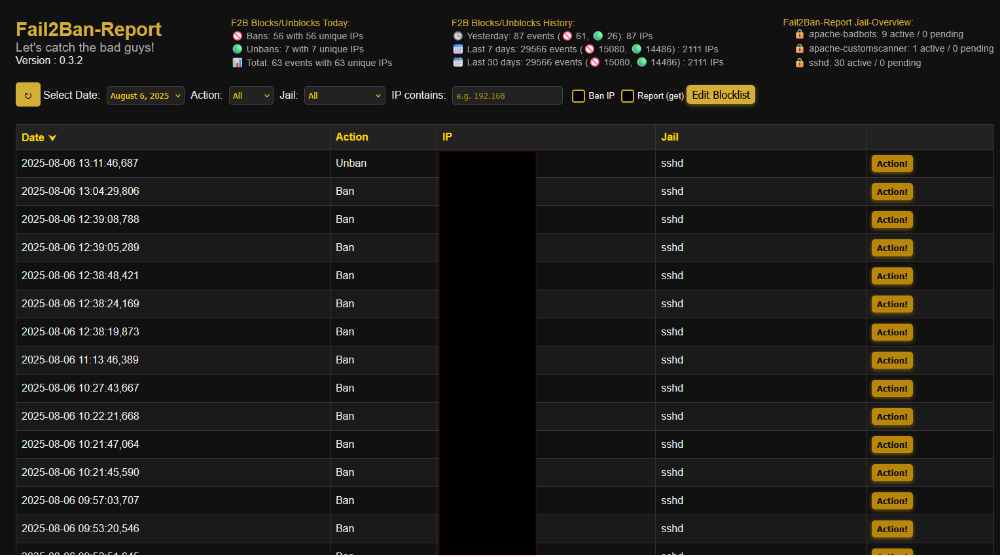
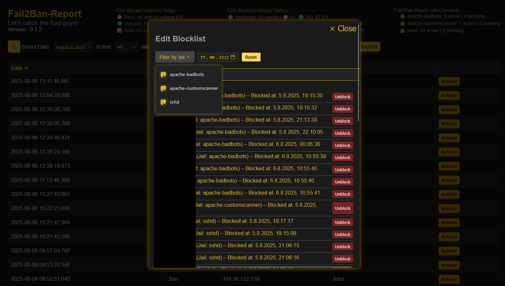
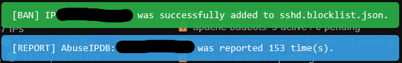

# Fail2Ban-Report
> Beta 3.2 | Version 0.3.2

A simple and clean web-based dashboard to turn your daily Fail2Ban logs into searchable and filterable JSON reports — with optional IP blocklist management for UFW.

🛡️ **Note**: This tool is a visualization and management layer — it does **not** replace proper intrusion detection or access control. Deploy it behind IP restrictions or HTTP authentication.

🔐 Security Notice

> **Current Status:**  
Fail2Ban-Report currently manages bans and unbans via **UFW** as a safe **intermediate solution**.  
It does **not yet** directly modify Fail2Ban jails or existing fail2ban configurations.

> **Future Direction:**  
The goal is to support **direct management of Fail2Ban jails** in upcoming versions — including user-controlled bans and unbans per jail.  
To ensure full control and auditability, all manual ban actions are already tracked in a structured `blocklist.json`, which will later serve as the trusted source for persistent and reviewable ban state.
 
Please read the [Installation Instructions](Setup-Instructions.md) carefully and secure your deployment with the provided `.htaccess`.
> still a little experimental feature : Use the Installer  It would be great if you tell me if the installer worked for your needs.

---

## 📚 What It Does
Fail2Ban-Report parses your fail2ban.log and generates JSON-based reports viewable via a web dashboard. It provides optional tools to:

- Visualize ban and unban events
- Interact with IPs (e.g., manually block or unblock)
- Maintain a persistent blocklist.json
- Sync that list with your system firewall using ufw (support for other firewalls or direct communication with Fail2Ban jails is not yet implemented)

## 🧱 Architecture overview:

- Backend Shell Scripts: Parse logs, generate JSON files, and update UFW rules based on blocklist.json
- Frontend Web Interface: Visualizes data and offers action controls
- JSON Blocklist: Stores manually blocked IPs marked with active=true

---

## 📦 Features

- 🔍 **Searchable + filterable** log reports (date, jail, IP)
- 🔧 **Integrated JSON blocklist** for persistent Block-Overview
- 🧱 **Firewall sync** using UFW (planned: nftables, firewalld)
- ⚡ **Lightweight setup** — no DB, no frameworks
- 🔐 **Compatible with hardened environments** (no external assets, strict headers)
- 🛠️ **Installer script** to automate setup and permissions
- 🧩 **Modular design** for easy extension
- 🪵 Optional logging of block/unblock actions (set true/false and logpath in `firewall-update.sh`)
- 🕵️ **Optional Feature :** IP reputation check via AbuseIPDB (manual lookup from web interface)

> 🧰 Works even on small setups (Raspberry Pi, etc.)

---

## 👥 Discussions

> If you want to join the conversation or have questions or ideas, visit the 💬 [Discussions page](https://github.com/SubleXBle/Fail2Ban-Report/discussions).

---

## 🆕 What's New in V 0.3.2

### 🧱 New Blocklist Logic
- 🔁 Blocking an IP address now stores it in a **jail-specific blocklist** (`blocklist["jailname"][]`) instead of one global list.
- 🔍 Improves clarity and allows easier tracking of blocked IPs **per jail**.

### 📊 Extended Statistics
- 📅 The Fail2Ban stats panel now includes:
  - ✅ **Today’s** bans & unbans (as before)
  - 🕓 **Yesterday**
  - 📈 **Last 7 Days**
  - 📊 **Last 30 Days**
- 🗂️ Based on your existing daily `fail2ban-events-YYYYMMDD.json` files — no setup needed.

### 🧩 Per-Jail Blocklist Display
- 🧾 Each jail now displays its own **blocklist section** with:
  - 🔒 Active bans
  - ⏳ Pending entries
- 🔄 Auto-refresh every **60 seconds**.
- 🧮 Layout adapts to **varying jail name lengths** — cleaner and more readable UI.

### ⚙️ Performance & UX
- 🚀 Optimized update intervals (**default: 10–60 seconds**).
- 🧘‍♂️ Minimal server and browser load — ideal for low-traffic admin use.

---

### ⚠️ Upgrade Notice

If you're upgrading from an existing installation:

- ⚠️ **The new blocklist format is not compatible with the old `blocklist.json`.**
- 🧹 To ensure a clean transition and avoid orphaned firewall entries, follow these steps:

  1. **Empty your current blocklist** via the **Unblock** buttons in the UI.
  2. 🔄 Trigger a **sync** using the `firewall-update.sh` to remove all Fail2Ban-Report-related rules from the firewall.
  3. 🗑️ Delete the old `blocklist.json`.
  4. 📦 Replace all files with the new version (overwrite).
  5. ✅ Done! The new system will now build jail-specific blocklists automatically.

- 🛠️ _Optional_ : Run the `installer.sh` again to get a fresh setup.

> This ensures no leftover blocks remain in your firewall from the previous system.

### 🔄 Updated and Added Files in v0.3.2

#### 🗂️ Backend (PHP / Shell)

- `includes/block-ip.php`  
  → Refactored to support jail-specific blocklists

- `includes/unblock-ip.php`  
  → Now handles unblocking from jail-based lists

- `includes/list-files.php`  
  → Modified to read multiple jail-specific blocklists

- `includes/footer.php`  
  → Includes references to new JS files

- `includes/fail2ban-logstats.php`  
  → Extended to calculate aggregate statistics (Today, Yesterday, Last 7/30 Days)

- `firewall-update.sh`  
  → Now processes `blocklist.json` with jail-based structure:  
  `{ "sshd": [...], "apache-auth": [...] }`

- `assets/css/style.css`  
  → added the new stuff (i know it is still a mess)

---

#### 🆕 New Files (JS)

- `assets/js/blocklist-stats.js`  
  → Displays per-jail "Active" and "Pending" IP statistics

- `assets/js/fail2ban-logstats.js`  
  → Displays time-based event statistics

---

---

## 📄 Changelog

Details about all new features, improvements, and changed files can be found in the [Changelog](changelog.md).

This is especially useful if you want to manually patch or update individual files.

---

## 🪳 Bugfixes

> - Found a bug? → [Open an issue](https://github.com/SubleXBle/Fail2Ban-Report/issues)

- ✅ **Date filter** now correctly limits displayed events
- ✅ **Jail filter** now correctly shows only the jails present in the displayed event list.
- ✅ **File date filtering** fix to include today's JSON logs and ensure latest files are listed correctly.
- ✅ **Blocklist Path on unblocking** fixed a possible bug that could lead to not finding the blocklist.json when unblocking from the Blocklist view.  
  → Hotfixed on 05.08.2025 at 13:10 (UTC+2) directly in main 

---

## 🛣️ Roadmap

### 🔧 Setup & Automation
- ✅ Automated installer script 
- ✅ Optional cron setup for log parsing and firewall sync
- 🧩 More robust installer
- ⏳ Secure-by-default deployments

### 🔐 Security
- ✅ Hardened `.htaccess` with best practices
- ✅ add security layer between json and js
- 🧩 moove `archive/` out of webdirectory
- ⏳ Further improvements (ongoing goal)

### 🔥 Active Defense
- ✅ Manual IP blocking via UI in UFW 
- ✅ IP reputation lookup via AbuseIPDB
- 🧩 Support for nftables, firewalld
- 🧩 full integration with fail2ban jails for block/unblock actions
- ⏳ Bulk blocking of multiple IPs
- ⏳ Optional automatic blocking based on patterns or thresholds
- ⏳ Integration with external services (e.g. AbuseIPDB reporting)

### 🌿 User Interface
- ⏳ Improve CSS and styling

## 👀 Outlook
- 📦 The next major version will focus on security by mooving and restructuring the `archive/` folder layout.
- 🐳 A Docker image is expected probably around version v0.5.x, following the restructuring.

---

## 🖼️ Screenshots

  

---

## 🤝 Contributing

Pull requests, feature ideas and bug reports are very welcome!

- Found a bug? → [Open an issue](https://github.com/SubleXBle/Fail2Ban-Report/issues)
- Want to contribute? → Fork and submit a pull request
- Have an idea? → Start a discussion or reach out directly : visit the 💬 [Discussions page](https://github.com/SubleXBle/Fail2Ban-Report/discussions)

> 💡 “Wouldn’t it be cool if it could also do XYZ?”  
> Absolutely — I’m happy to hear your ideas.

---

## 🧪 Experimental
- 🧪 [there is an highly experimental feature for using fail2ban instead of UFW.](using-Fail2Ban-firewall-update.md) (⚠️ not recommended)

---

## 📄 License

This project is licensed under the **GPLv3**.  
Feel free to use, modify and share — but please respect the license terms.
