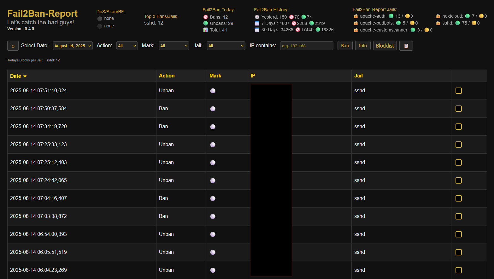

# Fail2Ban-Report
> Beta 4.0 | Version 0.4.0

> A simple and clean web-based dashboard to turn your daily Fail2Ban logs into searchable and filterable JSON reports — with optional IP blocklist management for UFW.

> This version brings more stability and performance, as well as improved visibility into Fail2Ban events.
> Also this is the **Start of the Docker-Version**

**Integration**
>Designed for easy integration on a wide range of Linux systems — from small Raspberry Pis to modest business setups — though it’s not (yet) targeted at large-scale enterprise environments.
Flexibility comes from the two backend shell scripts, which you can adapt to your specific environment or log sources to provide the JSON data the web interface needs (daily JSON event files).

🛡️ **Note**: This tool is a visualization and management layer — it does **not** replace proper intrusion detection or access control. Deploy it behind IP restrictions or HTTP authentication.

🔐 Security Notice

**Current Status:**  
> Fail2Ban-Report currently manages bans and unbans through **UFW**, serving as a safe **intermediate solution**.  
It does **not** directly modify Fail2Ban jails or change existing fail2ban configurations.

**Future Direction:**  
> A potential long-term enhancement could include **direct interaction with Fail2Ban jails** — for example, user-controlled bans and unbans per jail.  
The existing structured `*.blocklist.json` format is already designed to support this, ensuring that any future manual ban management can remain "persistent", reviewable, and fully auditable.

Please read the [Installation Instructions](Setup-Instructions.md) carefully and secure your deployment with the provided `.htaccess`.
> still a little experimental feature : Use the Installer  It would be great if you tell me if the installer worked for your needs.

---

## 📚 What It Does
Fail2Ban-Report parses your `fail2ban.log` and generates JSON-based reports viewable via a responsive web dashboard.  
It provides optional tools to:  

- 📊 Visualize **ban** and **unban** events, including per-jail statistics  
- ⚡ Interact with IPs (e.g., manually block, unblock, or report to external services)  
- 📂 Maintain **jail-specific** persistent blocklists (JSON) with `active` and `pending` status  
- 🔄 Sync those lists with your system firewall using **ufw**  
- 🚨 Show **warning indicators** when ban rates exceed configurable thresholds
- 🚨 Show **Markers** when a IP Address is present more than once in one or more jails.

> **Note:** Direct integration with other firewalls or native Fail2Ban jail commands is not yet implemented.

---

## 🧱 Architecture Overview
- **Backend Shell Scripts**:  
  - Parse logs and generate daily JSON event files  
  - Maintain and update `*.blocklist.json`  
  - Apply or remove firewall rules based on blocklist entries (`ufw`)  

- **Frontend Web Interface**:  
  - Displays event timelines, statistics, and per-jail blocklists  
  - Allows **multi-selection** for bulk ban/report actions  
  - Shows **pending status** for unprocessed manual actions  
  - Displays real-time warning indicators  

- **JSON Blocklists**:  
  - Stored per jail  
  - Contain IP entries with metadata (`active`, `pending`, timestamps, jail name)  

---

## 📦 Features

- 🔍 **Searchable + filterable** log reports (date, jail, IP)
- 🔧 **Integrated JSON blocklist** for persistent Block-Overview
- 🧱 **Firewall sync** using UFW (planned: nftables, firewalld)
- ⚡ **Lightweight setup** — no DB, no frameworks
- 🔐 **Compatible with hardened environments** (no external assets, strict headers)
- 🛠️ **Installer script** to automate setup and permissions
- 🧩 **Modular design** for easy extension
- 🪵 Optional logging of block/unblock actions (set true/false and logpath in `firewall-update.sh`)
- 🕵️ **Optional Feature :** IP reputation check via AbuseIPDB (manual lookup from web interface)

> 🧰 Works even on small setups (Raspberry Pi, etc.)

---

## 👥 Discussions

> If you want to join the conversation or have questions or ideas, visit the 💬 [Discussions page](https://github.com/SubleXBle/Fail2Ban-Report/discussions).

---

## 🆕 What's New in V 0.4.0

### 🧱 Firewall & JSON
- Optimized `firewall-update.sh` for faster batch processing of IPs.
- Batch blocking per jail with a single `ufw reload`.
- Safe unblocking with rule renumbering and reload after each deletion.
- JSON updates and cleanup done once per jail, not per IP.
- Core mechanisms, logging, and permissions unchanged.
> This significantly reduces both the runtime and the lock duration of the blocklists, especially during ban events.

### 🖥️ UI & Statistics
- Minor visual improvements in:
  - `header.php`, `fail2ban-logstats.php`, `fail2ban-logstats.js`
  - `index.php` (IP sorting)
  - `style.css`

### 🟡🔴 Marker Feature
- **IP Event Markers**: Highlights repeated events (yellow) and IPs in multiple jails (red).
- **Sortable & Filterable Mark Column**: New column `Mark` with dropdown filter.
- **Dynamic Filtering**: Markers update live with Action, Jail, IP, or Date filters.
- Marker column placed between Action and IP, responsive layout preserved.

### ✨ New Feature: Copy Filtered Data to Clipboard

- **Added** a new "Copy to Clipboard" button to export the currently **filtered table data**.
- **Implemented** a dedicated JavaScript file `assets/js/table-export.js` for the copy functionality.
- **Integration** with existing DataTables filtering logic to ensure only visible/filtered rows are copied.
- **Output Format**: Tab-separated values (TSV) with all HTML tags removed for clean text export.
- **User Feedback**: 
  - Shows a warning if there’s no data to copy.
  - Shows a success or error alert based on the clipboard operation result.

> This Feature will only work with enabled https for security reasons

---

### ⚠️ Upgrade Notice

If you're upgrading from an existing installation : pre 0.3.2 and also from 0.3.2

- ⚠️ **The new blocklist format is not compatible with the old `blocklist.json`.** and got new field `pending` is in json since 0.3.3
- 🧹 To ensure a clean transition and avoid orphaned firewall entries, follow these steps:

  1. **Empty your current blocklist** via the **Unblock** buttons in the UI.
  2. 🔄 Trigger a **sync** using the `firewall-update.sh` to remove all Fail2Ban-Report-related rules from the firewall.
  3. 🗑️ Delete the old `blocklist.json`.
  4. 📦 Replace all files with the new version (overwrite).
  5. ✅ Done! The new system will now build jail-specific blocklists automatically.

- 🛠️ _Optional_ : Run the `installer.sh` again to get a fresh setup.

> This ensures no leftover blocks remain in your firewall from the previous system.

---

## 📄 Changelog

Details about all new features, improvements, and changed files can be found in the [Changelog](changelog.md).

This is especially useful if you want to manually patch or update individual files.

---

## 🪳 Bugfixes

> - Found a bug? → [Open an issue](https://github.com/SubleXBle/Fail2Ban-Report/issues)

- ✅ **Date filter** now correctly limits displayed events
- ✅ **Jail filter** now correctly shows only the jails present in the displayed event list.
- ✅ **File date filtering** fix to include today's JSON logs and ensure latest files are listed correctly.
- ✅ **Blocklist Path on unblocking** fixed a possible bug that could lead to not finding the blocklist.json when unblocking from the Blocklist view.  
  → Hotfixed on 05.08.2025 at 13:10 (UTC+2) directly in latest
- ✅ **Installer** should now ask if you want to delete and reclone repo when allready existing
- ✅ **Added FLOCK** to lock json files to not loose data when several write processes write at the same time

---

## 🛣️ Roadmap

### 🔧 Setup & Automation
- ✅ Automated installer script 
- ✅ Optional cron setup for log parsing and firewall sync
- 🧩 More robust installer
- ⏳ Secure-by-default deployments

### 🔐 Security
- ✅ Hardened `.htaccess` with best practices
- ✅ add security layer between json and js
- ⏳ Further improvements (ongoing goal)

### 🔥 Active Defense
- ✅ Manual IP blocking via UI in UFW 
- ✅ IP reputation lookup via AbuseIPDB (optional)
- ✅ IP GeoLoc and Provider Data with IP-Info (optional)
- ✅ Bulk blocking of multiple IPs
- ✅ Shows warnings/critical states threshold for Bans/Minute/Jail (setable in config)
- ✅ Shows warning states for Ips that are more than once on List
- ✅ Shows critical states for IPs that are in more than one Jail in List
- 🧩 Support for nftables, firewalld
- ⏳ LTG: Integration with external services (e.g. AbuseIPDB reporting)
- ⏳ LTG: Integration with fail2ban-jails directly

### 🌿 User Interface
- ⏳ Improve CSS and styling

## 👀 Outlook
- 📦 Further Improvements & Security Enhancements
  - Moving `archive/` to `/opt` makes little sense if `www-data` still needs access.
  - Working on a solution to authorize changes made to JSON files via the web interface. 
- 🐳 A Docker image is expected probably around version v0.5.x

---

## 🖼️ Screenshots

  

---

## 🖥️ Demo
👀 Want to try out the look & feel?
There's a simple demo version available here – no backend, no real data:
👉 https://suble.net/ 🔗

---

## ✅ What It Is
- A **read-only + action-enabled** web dashboard for Fail2Ban events  
- A tool to **visualize** bans/unbans and **manually** manage blocked IPs  
- A **log parser + JSON generator** that works alongside your existing Fail2Ban setup  
- A way to **sync a persistent blocklist** with your firewall (currently **UFW only**)  
- Designed for **sysadmins** who want quick insights without SSH-ing into the server  

## ❌ What It Is Not
- ❌ A replacement for **Fail2Ban** itself (it depends on Fail2Ban)  
- ❌ A real-time IDS/IPS (data updates depend on log parsing intervals)  
- ❌ A universal firewall manager (no native support for iptables/nftables, etc. — yet)  
- ❌ A tool for **automatic** jail management (manual actions only for now)  
- ❌ A heavy analytics platform — it’s lightweight and log-driven by design  

---

## 🤝 Contributing

Pull requests, feature ideas and bug reports are very welcome!

- Found a bug? → [Open an issue](https://github.com/SubleXBle/Fail2Ban-Report/issues)
- Want to contribute? → Fork and submit a pull request
- Have an idea? → Start a discussion or reach out directly : visit the 💬 [Discussions page](https://github.com/SubleXBle/Fail2Ban-Report/discussions)

> 💡 “Wouldn’t it be cool if it could also do XYZ?”  
> Absolutely — I’m happy to hear your ideas.

---

## 📄 License

This project is licensed under the **GPLv3**.  
Feel free to use, modify and share — but please respect the license terms.
