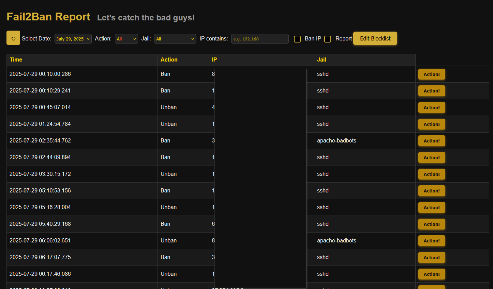
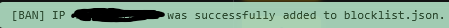
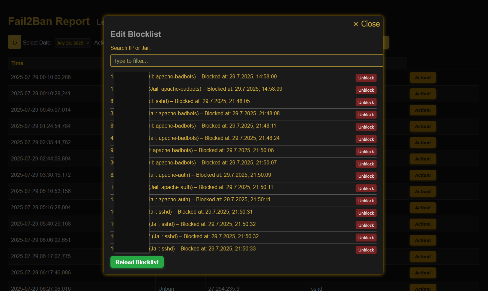

# Fail2Ban-Report

A simple and clean web-based reporting tool for Fail2Ban events.  
Web-based dashboard to turn your daily Fail2Ban logs into searchable and filterable JSON reports with optional IP blocklist management for UFW.

## 🛡️ This tool does not replace proper intrusion detection and access control. It is a visualization layer and should be deployed accordingly.

#### ❗ Please read the Installation Instructions carefully and set up your Security with the provided .htaccess file ❗

#### ⚠️ For safety and clarity, Fail2Ban-Report only modifies firewall rules related to its own IP blocklist (blocklist.json). It never touches or overrides other firewall settings, ensuring compatibility with existing Fail2Ban jails and custom rules.

> This Tool will read the logfile from fail2ban and write ban and Unban Events to a .json file stored on a secured webspace. The Tool will show those Events in a List with an Action Button to perform Actions to the Listed IP Address (e.g. Block IP) The IP will the be written to another .json File (Blocklist) with an "active=true" state, so when the Firewall-Script runs the next time it will Add those IP Adresses on the blocklist.json to the Firewall to block them - so they will also get reapplyed when the Server restarts as soon as the Firewall-Script runs the next time.

> When you Show the Blocklist (Button on Top of Page) you see the IP Addresses that are in the blocklist.json and you can perform an unblock Action. This will set active=false in the blocklist.json and as soon as the firewall-script runs the next time, it will perform an unblock action on this IP Address in the Firewall and remove the IP from the blocklist.json

> So you have the .sh Scripts acting as a backend (gather information from source and perform actions on the system) and the Frontend Layer on your Webspace for visualisation.

> So this Tool gets the Events from Fail2Ban and handles its own blocklist to perform Block and Unblock Actions on UFW

⚠️ Firewall Actions work only with UFW right now ⚠️

---

## 📦 Features

- **Overview** of Fail2Ban, ban history and active bans (depends on how often cronjobs run)
- **Integrated blocklist system** with JSON-based state tracking
- **Automatic firewall updates** (currently only via `ufw` other Firewall Systems planned for future release)
- **Lightweight web interface** (no database or frameworks required)
- Compatible with hardened environments (strict HTTP headers, no external assets)
- **Installer script** included for quick setup
- Easily extensible by its modular by design
- **Logging of Block and Unblock Actions** by setting LOGGING=true in firewall-update.sh
- This tool requires no database and can run even on very minimal webspace setups. (e.g. RaspberryPi)

---

## 📝 Release-Notes
+ modular design instead of one file for everything
+ Action Buttons added to perform (one or more) actions with the given IP
+ Edit Blocklist Button : will show the Blocklist
+ Action Checkboxes (Actions that are checked, will be performed by action button)
+ Action Ban IP will set the IP on blocklist.json and set it as active=true
+ Unblock in Blocklist will set the IP on the Blocklist as active=false
+ new .sh Script : firewall-uppdate.sh will perform firewall actions according to blocklist.json (block and unblock)

---

## 🪳 Bugfixing (a.k.a. cockroach control)

    ✅ Date Filter : will now show Events only from selected Date
    ✅ Jail Filter : will now only show Jails that show up in the List
    ⏳ Report Action is not implemented

---

## 🗺️ Roadmap & State of Project

Fail2Ban-Report is designed to be lightweight, modular, and open to future improvements. The following features are currently planned:

⚙️ Setup & Automation

    ✅ Setup script to automate initial installation, including directory structure and permissions
    ✅ Optionally auto-configure a daily cronjob
    ⏳ Make installer more robust
    ⏳ Ship better Security with installer

🔐 Security Features

    ✅ Integration of a stronger .htaccess file for basic access control and secure defaults
    ⏳ Make it even more secure and better (this will never get a check)

🔥 Active Defense Integration

    ✅ Allow manual IP blocking directly from the interface via ufw
    ⏳ add support for nft iptables firewalld
    ⏳ multiple blocking of suspicious IPs at once
    ⏳ Optionally enable automatic blocking of suspicious IPs based on defined criteria
    ⏳ add action for report to other Services (e.g. AbuseIPDB)

🌻 Beauty

    ⏳ Do some CSS Work to make it look nicer

---

## 🖥️ Screenshots

Main Window with List that shows you IP Jail Timestamp

feedback after ban action

Blocklist with unblock actions

---

## 🤝 Contributing

Pull requests and feedback are warmly welcome!

If you find a bug, have an idea, or want to contribute code, feel free to:

- Open an [Issue](https://github.com/YOUR_USERNAME/fail2ban-report/issues)
- Submit a [Pull Request](https://github.com/YOUR_USERNAME/fail2ban-report/pulls)

For larger features, feel free to start a discussion first.

I'm happy to hear from users and contributors!
Whether it's:

+ feature requests,
+ improvement ideas,
+ or even pull requests —
+ Feel free to reach out or contribute directly.

If you use this tool and think "Hey, wouldn't it be cool if it could also do XYZ?" — I'm all ears!

---

## 📄 License
This project is released under the GPLv3 License. Feel free to modify and share.

---
