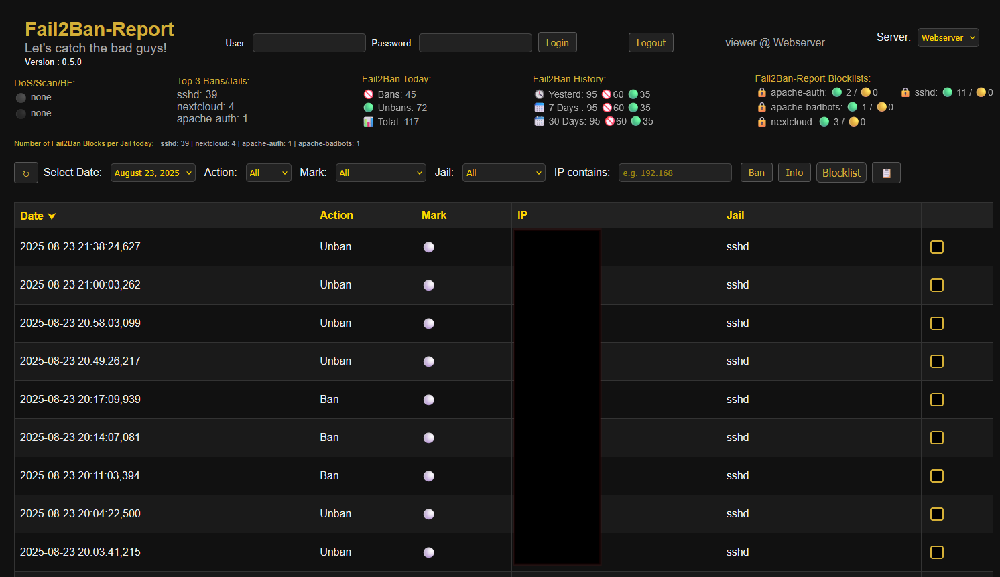
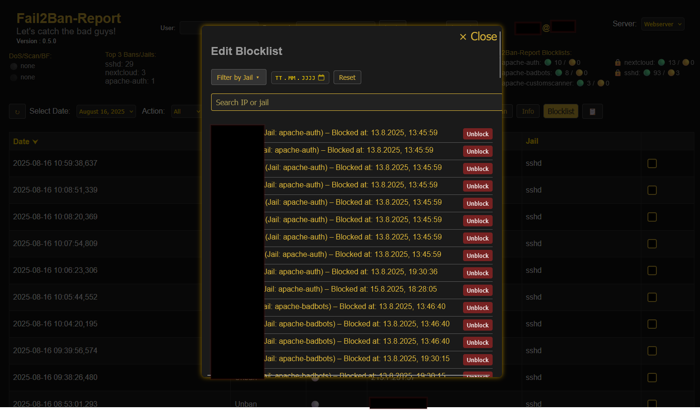
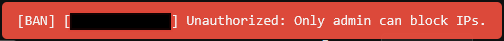
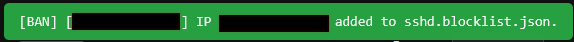

# Fail2Ban-Report
-gold?style=flat&logoColor=black)

> A lightweight web-based multi-server dashboard that transforms daily Fail2Ban logs into searchable and filterable JSON reports, while also providing centralized UFW IP blocklist management across all your servers through a pull-based client-side synchronization via secure HTTPS endpoints.

**Integration**
>Designed for easy integration on a wide range of Linux systems — from small Raspberry Pis to modest business setups — though it’s not (yet) targeted at large-scale enterprise environments.
High flexibility comes from the backend shell scripts, which you can adapt to your specific environment or log sources to provide the JSON data the web interface needs (daily JSON event files).

## 🛡️ **Note**: This tool is a visualization and management layer — it does **not** replace proper intrusion detection or access control. Deploy it behind IP restrictions or HTTP authentication only!

---

## 📑 Table of Contents

- [⚠️ Status of the Project](#️-status-of-the-project)
- [🖥️ Demo](#️-demo)
- [🛠️ Installation](#️-installation)
  - [🔧 New Installation : UI and local Fail2Ban Events](#-new-installation--ui-and-local-fail2ban-events)
  - [🔧 Existing Installations : UI and local Fail2Ban Events](#-existing-installations--ui-and-local-fail2ban-events)
  - [📡 Adding Sync-Clients](#-adding-sync-clients)
- [📚 What It Does](#-what-it-does)
- [🧱 Architecture Overview](#-architecture-overview)
- [⚙️ Requirements](#️-requirements)
  - [🗄️ Server](#️-server)
  - [📡 Sync-Client](#-sync-client)
- [📦 Features](#-features)
- [🆕 What's New in v0.5.0](#-whats-new-in-v050)
- [🪳 Bugfixes (History)](#-bugfixes-history)
- [👀 Outlook](#-outlook)
- [👥 Discussions](#-discussions)
- [📄 Changelog](#-changelog)
- [📄 License](#-license)
- [⚡ Performance & Stress Test](#-performance--stress-test)
- [🛣️ Roadmap or "Things I will have to do - but I do them later"](#️-roadmap-or-things-i-will-have-to-do---but-i-do-them-later)
- [✅ What It Is](#-what-it-is)
- [❌ What It Is Not](#-what-it-is-not)
- [🤝 Contributing](#-contributing)
- [🖼️ Screenshots](#screenshots)

---

## ⚠️ Status of the Project

**Current Status:**  
> Fail2Ban-Report currently manages bans and unbans via UFW, providing a safe and persistent solution.
It does not modify Fail2Ban jails or existing Fail2Ban configurations directly, instead using UFW for its own "permanent jails".

> **Version 0.5.0 introduces multi-server support and role-based access:** Viewer accounts are read-only, while Admins can manage bans/unbans and blocklists across all connected servers via the dashboard.

**Future Direction:**  
> A potential long-term enhancement could include **direct interaction with Fail2Ban jails** — for example, user-controlled bans and unbans per jail.  
The existing structured `*.blocklist.json` format is already designed to support this, ensuring that any future manual ban management can remain "persistent", reviewable, and fully auditable.

**Syncronisation-Concept and Chain of Trust**
> you can read about the Syncronisation Concept in this Document [Sync-Concept](Docs/Sync-Concept.md) to get a better understanding of how it works

> you can read about the "Chain of Trust" between Server and Clients in this Document: [Chain of Trust](Docs/chain-of-trust.md)

Critical backend operations (like UFW updates) are executed via root cron scripts; ensure the server running Fail2Ban-Report is fully secured.

##### [↑ Table of Contents ↑](#-Table-of-Contents)
---

## 🖥️ Demo
👀 Want to try out the look & feel?
There's a simple demo version available here – no backend, no real data:
👉 https://demo.suble.net/ 🔗
Username and Password for Website Access is : `admin`:`admin`
Username and Password for Blocklist manipulation is `admin`:`admin`

##### [↑ Table of Contents ↑](#-Table-of-Contents)
---

## 🛠️ Installation

### 🔧 New Installation : UI and local Fail2Ban Events
Please read the [Setup Instructions](Docs/Setup-Instructions.md) carefully and secure your deployment with the provided `.htaccess`.
> Have in mind, that you are installing Beta Software that could contain bugs or can change with next release.

### 🔧 Existing Installations : UI and local Fail2Ban Events
Read the [Setup Instructions]() carefully.
> Have in mind, that you are installing Beta Software that could contain bugs or can change with next release.

### 📡 Adding Sync-Clients
Read the [Instructions to add a Sync-Client for Fail2Ban-Report](Docs/Adding-Clients.md) carefully.
> Have in mind, that you are installing Beta Software that could contain bugs or can change with next release.

##### [↑ Table of Contents ↑](#-Table-of-Contents)
---

## 📚 What It Does

Fail2Ban-Report parses your `fail2ban.log` and generates JSON-based reports viewable via a responsive web dashboard.  
It provides optional tools to:

- 📊 View **ban/unban events** and per-jail statistics
- 🌐 Switch between multiple servers in a single dashboard
- 🔐 Use authentication with **viewer** (read-only) and **admin** (block/unblock) roles
- 📂 Maintain **persistent blocklists** (per jail and per server) with metadata (`active`, `pending`, `source`)
  - no fire & forget
- ⚡ Apply or remove firewall rules (currently via **ufw**)
- 🚨 Get configureable warnings for unusual activity (DDoS, brute-force, scans)
- 🚨 Mark IPs with 🔴 repeat bans or 🟡 ban increases
- 🔍 Optional integrations: (_Free API-KEYS_)
  - [AbuseIPDB](https://www.abuseipdb.com/) for reputation lookups
  - [IP-Info.io](https://ipinfo.io/) for region/provider checks

> **Note:** Viewer accounts are read-only. Direct integration with other firewalls or native Fail2Ban jail commands is not yet implemented.  

##### [↑ Table of Contents ↑](#-Table-of-Contents)
---

## 🧱 Architecture Overview

**Backend (Shell scripts):**
- Parse Fail2Ban logs → generate daily JSON event files
- Maintain and update jail-specific blocklists (`*.blocklist.json`)
- Sync blocklists with `ufw`
- Provide HTTPS endpoint for multi-server synchronization

**Frontend (PHP Web Interface):**
- Event timeline with filtering and search
- Per-jail blocklist view
- Multi-server dropdown
- Bulk actions (ban/unban/report)
- Pending status for actions not yet applied
- Warning/critical indicators for activity spikes
- Authentication: viewer (read-only) / admin (ban/unban)

**Blocklists (JSON):**
- Stored per jail and per server
- Include metadata: jail, status, timestamps, source
- Modified only by authenticated admins

##### [↑ Table of Contents ↑](#-Table-of-Contents)
---

## ⚙️ Requirements

### 🗄️ Server
- Fail2Ban with logging enabled  
- UFW (for firewall integration)    
- PHP 7.4+ with JSON support  
- HTTPS-capable web server (Apache or Nginx)  
- `bash` - (https://en.wikipedia.org/wiki/Bash_(Unix_shell))
- `jq`   - (https://jqlang.org/)
- `awk`  - (https://en.wikipedia.org/wiki/AWK)
- `curl` - (https://curl.se/)

### 📡 Sync-Client
- Fail2Ban with logging enabled  
- UFW (for firewall integration)    
- `bash` - (https://en.wikipedia.org/wiki/Bash_(Unix_shell))
- `jq`   - (https://jqlang.org/)
- `awk`  - (https://en.wikipedia.org/wiki/AWK)
- `curl` - (https://curl.se/)

##### [↑ Table of Contents ↑](#-Table-of-Contents)
---

## 📦 Features

- 🔍 Searchable & filterable event reports  
- 📊 Aggregated statistics (today, yesterday, 7 days, 30 days)  
- 📂 Jail- and server-specific blocklists  
- 🔄 Firewall sync with UFW  
- 🔐 Authentication with role separation  
- ⚡ Lightweight: no database, no frameworks  
- 🛠️ Setup scripts for installation, permissions, and user management  
- 🧩 Modular structure 
- 🪵 Optional backend logging for ban/unban actions  

> 🧰 Works even on small setups (Raspberry Pi, etc.)

##### [↑ Table of Contents ↑](#-Table-of-Contents)
---

## 🆕 What's New in v0.5.0

- 🌐 **Multi-server support** with HTTPS sync backend  
- 🔐 **User authentication** with roles (Admin / Viewer)  
- ⚙️ **Reorganized backend**:  
  - `archive/` separated per server (fail2ban / blocklists)  
  - `/opt/Fail2Ban-Report/` cleaned and structured  
  - Centralized path handling, less hardcoding  
- 🌐 **Frontend updates**:  
  - Server selection dropdown  
  - Admin login + logout (session handling)
  - changed Marker Feature to show: - 🔴 repeat bans |🟡(1) ban increases with the number how often it happend ([see bug reports)](#-bugfixes-history))
- 🔒 **Security updates**:  
  - Bcrypt password storage  
  - UUID and optional IP checks  
  - Additional `.htaccess` IP whitelist

##### [↑ Table of Contents ↑](#-Table-of-Contents)
---

## 🪳 Bugfixes (History)

Found a bug? → [Open an issue](https://github.com/SubleXBle/Fail2Ban-Report/issues)

> - ✅ **Date filter** now correctly limits displayed events (0.1.2)
> - ✅ **Jail filter** now correctly shows only the jails present in the displayed event list. (0.2.1)
> - ✅ **File date filtering** fix to include today's JSON logs and ensure latest files are listed correctly. (0.2.2)
> - ✅ **Blocklist Path on unblocking** fixed a possible bug that could lead to not finding the blocklist.json when unblocking from the Blocklist view. (0.2.2)
  → Hotfixed on 05.08.2025 at 13:10 (UTC+2) directly in latest (0.2.3)
> - ✅ **Installer** should now ask if you want to delete and reclone repo when allready existing (0.3.1)
> - ✅ **Added FLOCK** to lock json files to not loose data when several write processes write at the same time (0.3.2)
- ✅ **Handling of "Increase Ban" Events** : will now processed correct by backend and is also visible in frontend via markers (0.4.0)
  - Thanks to 👉 ***jbd7*** 👈 for reporting and debugging `issue #21` 👍.
- ⏳ **Copy to Clipboard** cannot copy the list when filtered by markers (0.5.0)

##### [↑ Table of Contents ↑](#-Table-of-Contents)
---

## 👀 Outlook
> besides stability, security and usability, next releases will focus more on statistics, integration of other firewalls and more fail2ban integration

##### [↑ Table of Contents ↑](#-Table-of-Contents)
---

## 👥 Discussions

> If you want to join the conversation or have questions or ideas, visit the 💬 [Discussions page](https://github.com/SubleXBle/Fail2Ban-Report/discussions).

##### [↑ Table of Contents ↑](#-Table-of-Contents)
---

## 📄 Changelog

Details about all new features, improvements, and changed files can be found in the [Changelog](changelog.md).

This is especially useful if you want to manually patch or update individual files.

##### [↑ Table of Contents ↑](#-Table-of-Contents)
---

## 📄 License

This project is licensed under the **GPLv3**.  
Feel free to use, modify and share — but please respect the license terms.

##### [↑ Table of Contents ↑](#-Table-of-Contents)
---

## ⚡ Performance & Stress Test

Fail2Ban-Report has been tested under high-load conditions to verify stability, responsiveness, and reliable synchronization across multiple servers.

**Real Scenario:**

- **Duration: ~10 minutes**
- **Webserver events:** ~13,400 entries across several jails (mostly SSH)
- **Data per event:** date, action, marker, IP, jail

**Key Results:**

- Since each ban is triggered after 4 failed attempts, the actual number of incoming requests corresponds to roughly 53,600 login attempts over 10 minutes → about 5,360 requests per minute (≈ 89 requests per second).
- The WebUI loads all 13,480 daily JSON entries in about 1.5 seconds.
- Connected clients consistently pulled and pushed blocklists without any delay. Even when a blocklist update included 80+ new IP entries, the synchronization completed in a blink of an eye, with changes applied in both directions instantly.
- Switching between multiple servers in the dashboard remains smooth, typically under 2 seconds, even during attacks.

**Takeaway:**

Fail2Ban-Report maintains fast performance and reliable data synchronization, proving its suitability for multi-server setups and high-frequency event environments.

##### [↑ Table of Contents ↑](#-Table-of-Contents)
---

## 🛣️ Roadmap or "Things I will have to do - but I do them later"

> I gave up the usual Roadmap - to have more freedom with development - Things like Multiserver was never on the Roadmap but allways in my mind.

- ⏳ Rework Blocklist Overlay
- ⏳ Rework Stylesheet
- ⏳ Rework Info Notices

> As I am using Fail2Ban-Report I think it has a lot of potential to become something nice for not just myself.

> Suggestions and Ideas still welcome at any time (see Discussions) - When you are using Fail2Ban-Report and you think "I would need to see .. " tell me, I am happy to see your Ideas!

##### [↑ Table of Contents ↑](#-Table-of-Contents)
---

## ✅ What It Is
- A **role-based web dashboard** for Fail2Ban events: read-only for Viewers, action-enabled for Admins  
- A tool to **visualize** bans/unbans and **manually** manage blocked IPs  
- A **log parser + JSON generator** that works alongside your existing Fail2Ban setup  
- A way to **sync a persistent, per-jail blocklist** with your firewall (currently **UFW only**)  
- Supports **multi-server setups**, allowing you to switch between servers in the dashboard  
- Designed for **sysadmins** who want quick insights without SSH-ing into the server  

## ❌ What It Is Not
- ❌ A replacement for **Fail2Ban** itself (it depends on Fail2Ban)  
- ❌ A real-time IDS/IPS (data updates depend on log parsing intervals)  
- ❌ A universal firewall manager (no native support for iptables/nftables, etc. — yet)  
- ❌ A tool for **automatic** jail management (manual actions only for now)  
- ❌ A heavy analytics platform — it’s lightweight and log-driven by design
- ❌ A Playground for inexperienced People trying to block half of the Internet

##### [↑ Table of Contents ↑](#-Table-of-Contents)
---

## 🤝 Contributing

Pull requests, feature ideas and bug reports are very welcome!

- Found a bug? → [Open an issue](https://github.com/SubleXBle/Fail2Ban-Report/issues)
- Want to contribute? → Fork and submit a pull request
- Have an idea? → Start a discussion or reach out directly : visit the 💬 [Discussions page](https://github.com/SubleXBle/Fail2Ban-Report/discussions)

> 💡 “Wouldn’t it be cool if it could also do XYZ?”  
> Absolutely — I’m happy to hear your ideas.

##### [↑ Table of Contents ↑](#-Table-of-Contents)
---

## 🖼️ Screenshots

### Main List

### Blocklist View

### Information Message

### Security Message (new)

### Ban Message

##### [↑ Table of Contents ↑](#-Table-of-Contents)
---
