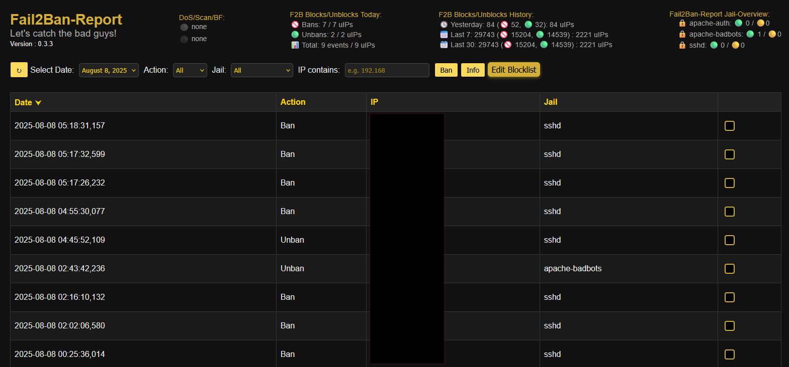

# Fail2Ban-Report
> Beta 3.3 | Version 0.3.3

A simple and clean web-based dashboard to turn your daily Fail2Ban logs into searchable and filterable JSON reports — with optional IP blocklist management for UFW.

🛡️ **Note**: This tool is a visualization and management layer — it does **not** replace proper intrusion detection or access control. Deploy it behind IP restrictions or HTTP authentication.

🔐 Security Notice

> **Current Status:**  
Fail2Ban-Report currently manages bans and unbans via **UFW** as a safe **intermediate solution**.  
It does **not yet** directly modify Fail2Ban jails or existing fail2ban configurations.

> **Future Direction:**  
The goal is to support **direct management of Fail2Ban jails** in upcoming versions — including user-controlled bans and unbans per jail.  
To ensure full control and auditability, all manual ban actions are already tracked in a structured `*.blocklist.json`, which will later serve as the trusted source for persistent and reviewable ban state.
 
Please read the [Installation Instructions](Setup-Instructions.md) carefully and secure your deployment with the provided `.htaccess`.
> still a little experimental feature : Use the Installer  It would be great if you tell me if the installer worked for your needs.

---

## 📚 What It Does
Fail2Ban-Report parses your `fail2ban.log` and generates JSON-based reports viewable via a responsive web dashboard.  
It provides optional tools to:  

- 📊 Visualize **ban** and **unban** events, including per-jail statistics  
- ⚡ Interact with IPs (e.g., manually block, unblock, or report to external services)  
- 📂 Maintain **jail-specific** persistent blocklists (JSON) with `active` and `pending` status  
- 🔄 Sync those lists with your system firewall using **ufw**  
- 🚨 Show **warning indicators** when ban rates exceed configurable thresholds  

> **Note:** Direct integration with other firewalls or native Fail2Ban jail commands is not yet implemented.

---

## 🧱 Architecture Overview
- **Backend Shell Scripts**:  
  - Parse logs and generate daily JSON event files  
  - Maintain and update `blocklist.json`  
  - Apply or remove firewall rules based on blocklist entries (`ufw`)  

- **Frontend Web Interface**:  
  - Displays event timelines, statistics, and per-jail blocklists  
  - Allows **multi-selection** for bulk ban/report actions  
  - Shows **pending status** for unprocessed manual actions  
  - Displays real-time warning indicators  

- **JSON Blocklists**:  
  - Stored per jail  
  - Contain IP entries with metadata (`active`, `pending`, timestamps, jail name)  

---

## 📦 Features

- 🔍 **Searchable + filterable** log reports (date, jail, IP)
- 🔧 **Integrated JSON blocklist** for persistent Block-Overview
- 🧱 **Firewall sync** using UFW (planned: nftables, firewalld)
- ⚡ **Lightweight setup** — no DB, no frameworks
- 🔐 **Compatible with hardened environments** (no external assets, strict headers)
- 🛠️ **Installer script** to automate setup and permissions
- 🧩 **Modular design** for easy extension
- 🪵 Optional logging of block/unblock actions (set true/false and logpath in `firewall-update.sh`)
- 🕵️ **Optional Feature :** IP reputation check via AbuseIPDB (manual lookup from web interface)

> 🧰 Works even on small setups (Raspberry Pi, etc.)

---

## 👥 Discussions

> If you want to join the conversation or have questions or ideas, visit the 💬 [Discussions page](https://github.com/SubleXBle/Fail2Ban-Report/discussions).

---

## 🆕 What's New in V 0.3.3 (QoL Update)
### ⚠️ Warning System and Pending Status Indicators
- 🚨 New [Warnings] section in .config to configure warning & critical thresholds (events per minute per jail) in format warning:critical (e.g: 20:50).
- 👀 warning & critical status indicators (colored dots) in the header for quick overview.
- ⏳ Manual block/unblock actions now mark IPs as pending until processed by firewall-update.
- 📊 Pending entries are now visible in blocklist stats for better tracking.

### ✔️ Multi-Selection UI and Bulk Actions for Ban & Report
- ✅ Switched from per-row action buttons to checkbox multi-selection for IPs.
- 📋 New dedicated “Ban” and “Info” buttons for bulk processing.
- 🔄 Frontend updated to handle and display results for multiple IP actions simultaneously.
- 🔔 New notification system for success/info/error messages on each action.

### 🛠 Backend Improvements & New IP Reporting
- 🔄 Backend now accept arrays of IPs for ban and report actions, with detailed aggregated feedback.
- 🆕 Added IPInfo API integration alongside AbuseIPDB for richer geolocation and network info.
- ⏲️ Built-in delay between report requests to avoid API rate limits.
- ⚙️ Improved error handling and user feedback for multi-IP operations.

---

### ⚠️ Upgrade Notice

If you're upgrading from an existing installation : pre 0.3.2 and also from 0.3.2

- ⚠️ **The new blocklist format is not compatible with the old `blocklist.json`.** and got new field `pending` is in json since 0.3.3
- 🧹 To ensure a clean transition and avoid orphaned firewall entries, follow these steps:

  1. **Empty your current blocklist** via the **Unblock** buttons in the UI.
  2. 🔄 Trigger a **sync** using the `firewall-update.sh` to remove all Fail2Ban-Report-related rules from the firewall.
  3. 🗑️ Delete the old `blocklist.json`.
  4. 📦 Replace all files with the new version (overwrite).
  5. ✅ Done! The new system will now build jail-specific blocklists automatically.

- 🛠️ _Optional_ : Run the `installer.sh` again to get a fresh setup.

> This ensures no leftover blocks remain in your firewall from the previous system.

---

## 📄 Changelog

Details about all new features, improvements, and changed files can be found in the [Changelog](changelog.md).

This is especially useful if you want to manually patch or update individual files.

---

## 🪳 Bugfixes

> - Found a bug? → [Open an issue](https://github.com/SubleXBle/Fail2Ban-Report/issues)

- ✅ **Date filter** now correctly limits displayed events
- ✅ **Jail filter** now correctly shows only the jails present in the displayed event list.
- ✅ **File date filtering** fix to include today's JSON logs and ensure latest files are listed correctly.
- ✅ **Blocklist Path on unblocking** fixed a possible bug that could lead to not finding the blocklist.json when unblocking from the Blocklist view.  
  → Hotfixed on 05.08.2025 at 13:10 (UTC+2) directly in latest
=======

---

## 🛣️ Roadmap

### 🔧 Setup & Automation
- ✅ Automated installer script 
- ✅ Optional cron setup for log parsing and firewall sync
- 🧩 More robust installer
- ⏳ Secure-by-default deployments

### 🔐 Security
- ✅ Hardened `.htaccess` with best practices
- ✅ add security layer between json and js
- 🧩 moove `archive/` out of webdirectory
- ⏳ Further improvements (ongoing goal)

### 🔥 Active Defense
- ✅ Manual IP blocking via UI in UFW 
- ✅ IP reputation lookup via AbuseIPDB
- 🧩 Support for nftables, firewalld
- 🧩 full integration with fail2ban jails for block/unblock actions
- ⏳ Bulk blocking of multiple IPs
- ⏳ Optional automatic blocking based on patterns or thresholds
- ⏳ Integration with external services (e.g. AbuseIPDB reporting)

### 🌿 User Interface
- ⏳ Improve CSS and styling

## 👀 Outlook
- 📦 The next major version will focus on security by mooving and restructuring the `archive/` folder layout.
- 🐳 A Docker image is expected probably around version v0.5.x, following the restructuring.

---

## 🖼️ Screenshots

  

---

## 🖥️ Demo
👀 Want to try out the look & feel?
There's a simple demo version available here – no backend, no real data:
👉 https://suble.net/ 🔗

---

## 🤝 Contributing

Pull requests, feature ideas and bug reports are very welcome!

- Found a bug? → [Open an issue](https://github.com/SubleXBle/Fail2Ban-Report/issues)
- Want to contribute? → Fork and submit a pull request
- Have an idea? → Start a discussion or reach out directly : visit the 💬 [Discussions page](https://github.com/SubleXBle/Fail2Ban-Report/discussions)

> 💡 “Wouldn’t it be cool if it could also do XYZ?”  
> Absolutely — I’m happy to hear your ideas.

---

## 🧪 Experimental
- 🧪 [there is an highly experimental feature for using fail2ban instead of UFW.](using-Fail2Ban-firewall-update.md) (⚠️ not recommended)

---

## 📄 License

This project is licensed under the **GPLv3**.  
Feel free to use, modify and share — but please respect the license terms.
