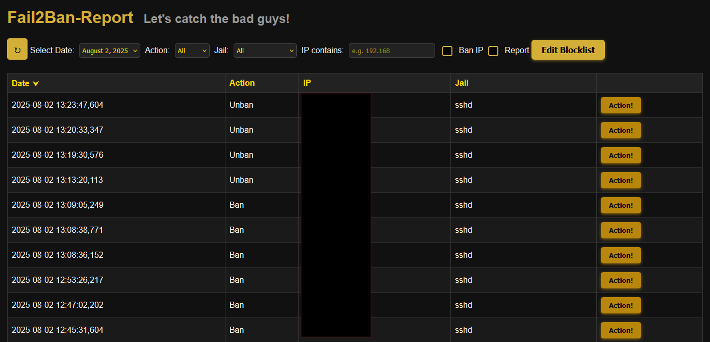
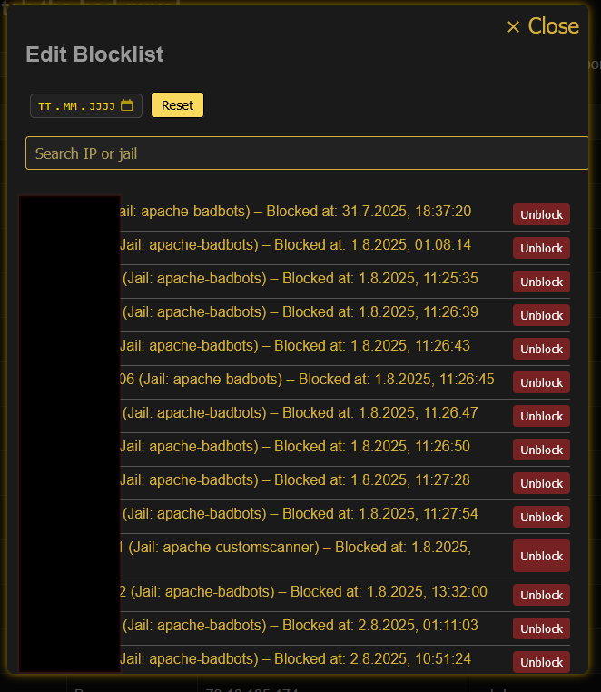

# Fail2Ban-Report
> Beta 3 | Version 0.3.1

A simple and clean web-based dashboard to turn your daily Fail2Ban logs into searchable and filterable JSON reports — with optional IP blocklist management for UFW.

🛡️ **Note**: This tool is a visualization and management layer — it does **not** replace proper intrusion detection or access control. Deploy it behind IP restrictions or HTTP authentication.

🔐 Security Notice

> **Current Status:**  
Fail2Ban-Report currently manages bans and unbans via **UFW** as a safe **intermediate solution**.  
It does **not yet** directly modify Fail2Ban jails or existing fail2ban configurations.

> **Future Direction:**  
The goal is to support **direct management of Fail2Ban jails** in upcoming versions — including user-controlled bans and unbans per jail.  
To ensure full control and auditability, all manual ban actions are already tracked in a structured `blocklist.json`, which will later serve as the trusted source for persistent and reviewable ban state.
 
Please read the [Installation Instructions](Setup-Instructions.md) carefully and secure your deployment with the provided `.htaccess`.
> still a little experimental feature : Use the Installer  It would be great if you tell me if the installer worked for your needs.

---

## 📚 What It Does

Fail2Ban-Report parses your `fail2ban.log` and generates JSON-based reports viewable via a web dashboard. It adds optional tools to:

- Visualize ban/unban events
- Interact with IPs (e.g. manually block/unblock)
- Maintain a persistent `blocklist.json`
- Sync that list with your system firewall (via `ufw` (other Firewalls than UFW or direct communication with fail2ban jails **not yet** supported))

🧱 The architecture:
- **Backend Shell Scripts**: Parse logs, write JSON, and update UFW accordingly to `blocklist.json`
- **Frontend Web Interface**: Visualizes data and offers action buttons
- **JSON Blocklist**: Stores manually blocked IPs (`active=true`)

---

## 📦 Features

- 🔍 **Searchable + filterable** log reports (date, jail, IP)
- 🔧 **Integrated JSON blocklist** with action buttons
- 🧱 **Firewall sync** using UFW (planned: nftables, firewalld)
- ⚡ **Lightweight setup** — no DB, no frameworks
- 🔐 **Compatible with hardened environments** (no external assets, strict headers)
- 🛠️ **Installer script** to automate setup and permissions
- 🧩 **Modular design** for easy extension
- 🪵 Optional logging of block/unblock actions (set true/false and logpath in `firewall-update.sh`)
- 🕵️ **Optional Feature :** IP reputation check via AbuseIPDB (manual lookup from web interface)

> 🧰 Works even on small setups (Raspberry Pi, etc.)

---

## 👥 Discussions

> If you want to join the conversation or have questions or ideas, visit the 💬 [Discussions page](https://github.com/SubleXBle/Fail2Ban-Report/discussions).

---

## 🆕 What's New in V 0.3.1
- 

🧪 [as promised there is an highly experimental feature for using fail2ban instead of UFW.](using-Fail2Ban-firewall-update.md) (⚠️ not recommended)

---

## 📄 Changelog

Details about all new features, improvements, and changed files can be found in the [Changelog](changelog.md).

This is especially useful if you want to manually patch or update individual files.

---

## 🪳 Bugfixes

> - Found a bug? → [Open an issue](https://github.com/SubleXBle/Fail2Ban-Report/issues)

- ✅ **Date filter** now correctly limits displayed events
- ✅ **Jail filter** now correctly shows only the jails present in the displayed event list.
- ✅ **File date filtering** fix to include today's JSON logs and ensure latest files are listed correctly.

---

## 🛣️ Roadmap

### 🔧 Setup & Automation
- ✅ Automated installer script 
- ✅ Optional cron setup for log parsing and firewall sync
- 🧩 More robust installer
- ⏳ Secure-by-default deployments

### 🔐 Security
- ✅ Hardened `.htaccess` with best practices
- 🧩 add security layer between json and js to harden `includes/` and `archive/` better
- ⏳ Further improvements (ongoing goal)

### 🔥 Active Defense
- ✅ Manual IP blocking via UI in UFW 
- ✅ IP reputation lookup via AbuseIPDB
- 🧩 Support for nftables, firewalld
- 🧩 full integration with fail2ban jails for block/unblock actions
- ⏳ Bulk blocking of multiple IPs
- ⏳ Optional automatic blocking based on patterns or thresholds
- ⏳ Integration with external services (e.g. AbuseIPDB reporting)

### 🌿 User Interface
- ⏳ Improve CSS and styling

## 👀 Outlook
- 🔭 next version will focus on security and stability by establishing better seperation between frontend and backend.

---

## 🖼️ Screenshots

  

---

## 🤝 Contributing

Pull requests, feature ideas and bug reports are very welcome!

- Found a bug? → [Open an issue](https://github.com/SubleXBle/Fail2Ban-Report/issues)
- Want to contribute? → Fork and submit a pull request
- Have an idea? → Start a discussion or reach out directly : visit the 💬 [Discussions page](https://github.com/SubleXBle/Fail2Ban-Report/discussions)

> 💡 “Wouldn’t it be cool if it could also do XYZ?”  
> Absolutely — I’m happy to hear your ideas.

---

## 📄 License

This project is licensed under the **GPLv3**.  
Feel free to use, modify and share — but please respect the license terms.
